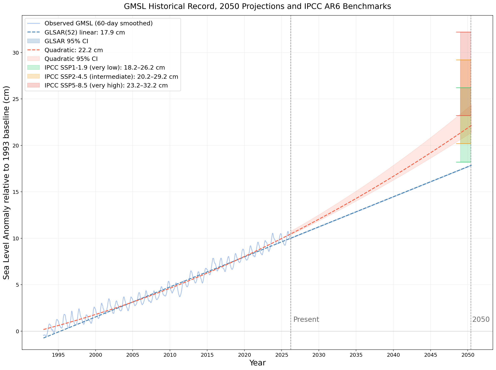

# Global Sea Level Rise: Trend Analysis and Projection

Analysis of the NASA-SSH Global Mean Sea Level (GMSL) indicator dataset, derived from satellite altimetry missions including TOPEX/Poseidon, the Jason series, and Sentinel-6. The dataset spans January 1993 to the present.

[GitHub Profile](https://github.com/MattOTI) [LinkedIn](https://www.linkedin.com/in/mattoti) [Original Dataset](https://doi.org/10.5067/NSIND-GMSV1)

## How It's Made

**Tech Used:** Python, VS Code, Jupyter Notebooks

Analysis involved initial inspection, data parsing and cleaning of a NASA ASCII time series, conversion of decimal year formatting to datetime objects, and seasonal amplitude analysis. OLS linear regression was applied to establish the long-term rate of rise, with autocorrelation diagnosed via the Durbin-Watson statistic and ACF plot, and corrected using Generalised Least Squares (GLSAR(52)). A quadratic model was fitted to capture observed acceleration, with uncertainty quantified via 52-week block bootstrap. Projections were contextualised against IPCC AR6 likely ranges for 2050 and 2100.

Pandas, NumPy, SciPy and Statsmodels utilised for data manipulation and statistical modelling. Matplotlib used for all visualisations.



## SQL Queries

Four queries are included in the `sql/` folder for use in a BigQuery environment, using the `gmsl_observations` table derived from the raw NASA-SSH dataset.

- **Annual Means**: Average GMSL per calendar year, providing a cleaner long-term trend than the raw weekly observations
- **Decadal Means**: Mean, min, and max GMSL grouped by decade, quantifying acceleration across the satellite record
- **Monthly Climatology**: Average GMSL by calendar month across all years, highlighting the seasonal cycle
- **YOY Change**: Year-on-year difference in mean GMSL, showcasing periods of faster or slower rise

## Key Findings

The long-term rate of sea level rise is **3.236 mm/year** (GLSAR(52) corrected), with R² = 0.96 confirming a statistically significant upward trend across the full 33-year record.

OLS residuals exhibited strong positive autocorrelation (Durbin-Watson: 0.0413), with GLSAR(52) correction inflating standard errors by a factor of 15.6x.

Residual analysis confirmed non-linearity in the record, independently validating the quadratic model. The quadratic fit projects **22.2 cm** (95% CI: 21.3–24.3 cm) above the 1993 baseline by 2050, and **57.3 cm** (95% CI: 52.5–68.8 cm) by 2100. This was shown to be consistent with the IPCC AR6 SSP1-1.9 likely range at both time horizons.

Seasonal amplitude showed no statistically significant trend (p = 0.12)

## Project Structure

```
sea-level-rise/
├── data/
│   └── NASA_SSH_GMSL_INDICATOR.txt
├── images/
│   ├── acf_residuals.png
│   ├── amplitude_analysis.png
│   ├── gmsl_historical.png
│   ├── gmsl_ipcc_comparison.png
│   ├── gmsl_projection.png
│   ├── residual_comparison.png
│   └── rolling_rate.png
├── notebooks/
│   └── sea_level_analysis.ipynb
├── sql/
│   ├── Annual Means.sql
│   ├── Decadal Means.sql
│   ├── Monthly Climatology.sql
│   └── YOY Change.sql
├── .gitignore
├── LICENSE
└── README.md
```

## Further Work

- **Seasonal Decomposition**: Formal separation of trend, seasonal, and residual components using statsmodels
- **Regional Analysis**: Comparison of GMSL against basin-level trends using the NASA-SSH gridded product
- **ENSO Signal Extraction**: Quantifying the contribution of El Niño/La Niña cycles to interannual GMSL variability

## Licence

This project is licensed under the MIT Licence.

Data preparation carried out in part at the Jet Propulsion Laboratory, California Institute of Technology, under contract with NASA (80NM0018D0004).

NASA-SSH. 2025. SSH Global Mean Sea Level from Simple Gridded Sea Surface Height. PO.DAAC, CA, USA. Dataset accessed [2026-03-22] at https://doi.org/10.5067/NSIND-GMSV1
